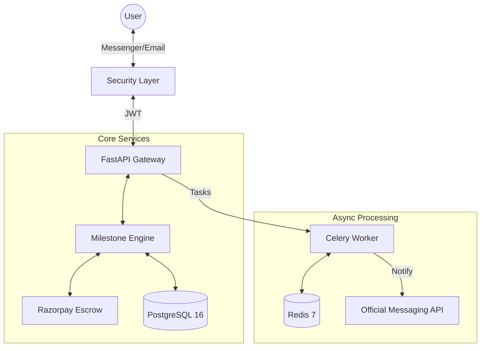

# StayVise 🔐

[](https://reactjs.org/)
[](https://fastapi.tiangolo.com/)
[](https://www.docker.com/)
[](https://razorpay.com/)

> **Standardizing Trust for Indian Freelancers.**  
> A Messenger-native milestone escrow platform built to eliminate payment risk.

StayVise solves the "trust gap" between independent creators and clients through smart milestone contracts, automated escrow management, and zero-friction onboarding via StayVise Messenger.

---

## 🏗 System Architecture



## 💎 Core Features

- **Messenger-Native Experience**: Onboard, receive milestone alerts, and approve payments directly from your chat.
- **Milestone Escrow**: Funds are secured via Razorpay's Route API at every step. No more "client ghosting."
- **TrustScore Engine**: Dynamic reputation calculation based on delivery speed, dispute history, and volume.
- **Email Magic Links**: Password-less, secure authentication for maximum friction reduction.
- **Admin Command Center**: Whitelisted administrative portal (Magic Link only) for platform oversight.

---

## 🛠 Tech Stack

- **Backend**: Python 3.12 / FastAPI (Async)
- **Database**: PostgreSQL 16 / SQLAlchemy 2.0 / Alembic
- **Caching & Messaging**: Redis 7 / Celery
- **Frontend**: TypeScript / React 18 / Tailwind CSS
- **Infrastructure**: Docker Compose / Nginx
- **Security**: JWT-based session management, Magic Link Auth

---

## 🚀 Quick Start

### 1. Configure Secrets
Copy the template and populate it with your credentials:
```bash
cp .env.example .env
```

### 2. Start Infrastructure
Launch the entire stack with a single command:
```bash
docker compose up -d --build
```

### 3. Initialize Database
Apply migrations to prepare the PostgreSQL schema:
```bash
docker compose exec backend alembic upgrade head
```

### 4. Access the Platform
- **Frontend**: [http://localhost:5173](http://localhost:5173)
- **API Docs**: [http://localhost:8000/docs](http://localhost:8000/docs)
- **Admin Portal**: [http://localhost:5173/admin/login](http://localhost:5173/admin/login)

---

## 📁 Repository Structure

```text
StayVise/
├── backend/            # FastAPI source, migrations, and tests
├── frontend/           # React + Vite application
├── infra/              # Database initialization and configs
├── docs/               # Detailed setup & production guides
├── docker-compose.yml  # Multi-container orchestration
└── .env.example        # Reference for environment variables
```

---

## ⚖️ License
Distributed under the MIT License. See `LICENSE` for more information.

Developed with ❤️ for the Indian Freelance Community.
